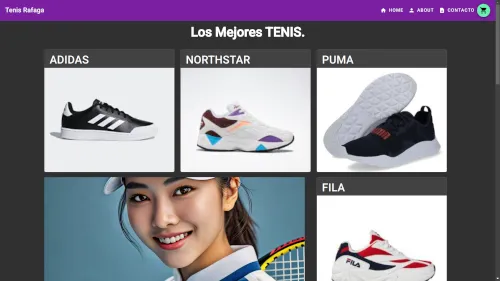
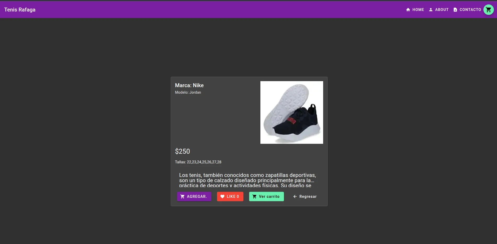
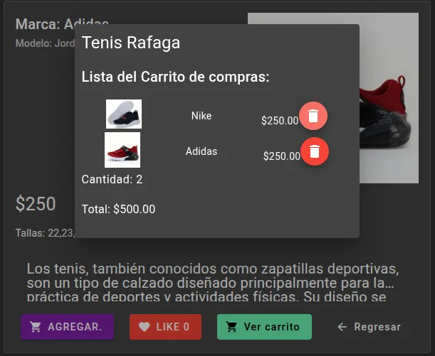
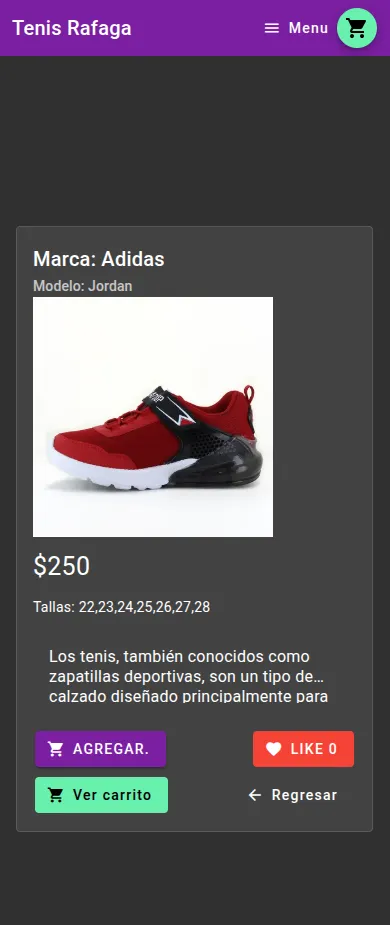

# 👟 Tienda de Tenis - Frontend

[](https://angular.io/)
[](https://www.typescriptlang.org/)
[](https://opensource.org/licenses/MIT)

Esta es la interfaz de usuario para la **Tienda de Tenis**, una aplicación de comercio electrónico diseñada para la visualización y gestión de calzado deportivo. El proyecto está construido con **Angular 17** y consume una API REST desarrollada en **Flask**.

> [!IMPORTANT]
> Este proyecto es parte de mi portafolio profesional. El backend que alimenta esta interfaz se encuentra en [tienda_tenis_backend](https://github.com/marco3islas/tienda_tenis_backend).

---

## 📸 Demostración






---

## ✨ Características Principales

- **Catálogo Dinámico:** Visualización de productos obtenidos desde una base de datos SQLite mediante una API.
- **Gestión de Carrito:** Funcionalidad para agregar y gestionar productos seleccionados.
- **Interfaz Responsiva:** Diseño adaptado para diferentes tamaños de pantalla utilizando CSS moderno.
- **Integración con Scraping:** Los datos de los productos fueron recolectados mediante herramientas de web scraping personalizadas.

---

## 🛠️ Stack Tecnológico

- **Framework:** Angular 17.3.5.
- **Lenguajes:** TypeScript (60%), HTML (26.2%), CSS (13.8%).
- **Comunicación:** Consumo de API REST con servicios de Angular.
- **Herramientas:** Angular CLI para scaffolding y construcción.

---

## 🚀 Instalación y Uso Local

### Requisitos previos

- Node.js y npm instalados.
- Angular CLI (`npm install -g @angular/cli`).

### Pasos

1. **Clonar el repositorio:**

   ```bash
   git clone https://github.com/marco3islas/teindaTenis_frontend.git
   cd teindaTenis_frontend
   ```

2. **Instalar dependencias:**

   ```bash
   npm install
   ```

3. **Ejecutar el servidor de desarrollo:**

   ```bash
   ng serve
   ```

   Navega a `http://localhost:4200/`. La aplicación se recargará automáticamente si cambias algún archivo fuente.

---

## 🏗️ Arquitectura y Flujo

La aplicación frontend se comunica con un backend en **Flask** que utiliza **Flask-CORS** para permitir las peticiones entre dominios. La lógica de negocio se divide en componentes de Angular para asegurar la modularidad y escalabilidad del código.

---

## 🛣️ Hoja de Ruta (Roadmap)

Actualmente, el proyecto es una versión funcional básica, pero tengo planeado implementar:

- [ ] **Sistema de Autenticación:** Integración de JWT para perfiles de usuario.
- [ ] **Pasarela de Pagos:** Simulación de pagos con la API de Stripe.
- [ ] **Pruebas Unitarias:** Cobertura completa de tests con Karma.

---

## 👤 Autor

**Marco Antonio Islas**

- GitHub: [@marco3islas](https://github.com/marco3islas)
- LinkedIn: _(Tu perfil de LinkedIn aquí)_

---

_Este proyecto fue generado originalmente con Angular CLI versión 17.3.5._
